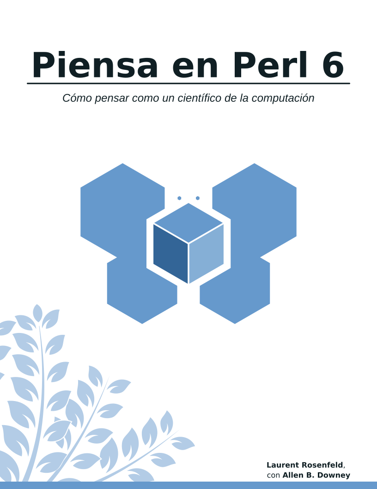

# Piensa Perl 6

* [Spanish](./README.md)

LaTeX source for the Spanish translation of Think Perl 6.



Translation by Luis F. Uceta.

The original version by Laurent Rosenfeld with Allen Downey can be found
here: [Think Perl 6](http://greenteapress.com/wp/think-perl-6/).

### How to create the PDF

The directory `book` contains the LaTeX files needed to compile the book.
To recompile it, run the following command within the directory:
```
make
```
This command will create the directory `tmpDir` where you'll find the PDF (thinkperl6.pdf)

> Note: The chances of a successful compilation increase if you have an almost
> complete installation of a recent Tex Live distro.

To get rid of all the intermediate files (including the PDF) created during the
compilation process, run:
```
make clean
```
If you wish to keep the PDF, just move it to another directory before running
`make clean`.

### Progress

* **Traducido**
- [x] Introducción 
- [x] Capítulo 01: La Forma del Programa
- [x] Capítulo 02: Variables, Expresiones y Sentencias
- [x] Capítulo 03: Funciones
- [x] Capítulo 04: Bucles, Condicionales y Recursión
- [x] Capítulo 05: Subrutinas Fructuosas
- [x] Capítulo 06: Iteración
- [x] Capítulo 07: Cadenas de Texto
- [ ] Capítulo 08: Caso Práctico: Juego de Palabras **TEP**
- [x] Capítulo 09: Arrays y Listas
- [x] Capítulo 10: Hashes
- [ ] Capítulo 11: Caso Práctico: Selección de una Estructura de Datos **TEP**
- [x] Capítulo 12: Clases y Objetos
- [x] Capítulo 13: Regexes y Gramáticas
- [x] Capítulo 14: Programación Funcional en Perl
- [x] Capítulo 15: Algunos Últimos Consejos
- [ ] Apéndice A:  Soluciones a los Ejercicios

* **Revised**

The revision process will begin after the translation is completed.

### Collaboration

If you wish to collaborate, you can choose any of the chapters that haven't been
translated yet and that don't have the tag **TEP** (Translation In Progress).

> TEP means somebody has claimed the tagged chapter and is working on it.

It's recommended that, after choosing a chapter, you make sure to update the README
file by adding TEP to its name. In this way, we make sure that only one person is
translating that particular chapter. After you're done with the translation, remove
the tag and mark the chapter as translated.
