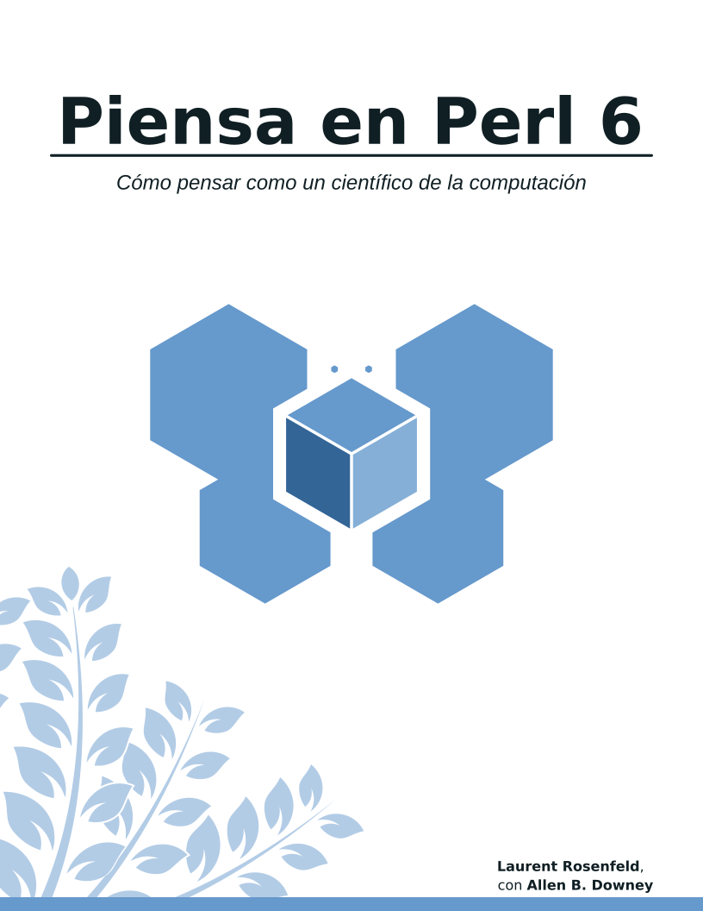

La traducción del libro casi está completa. Este repositorio ha sido 
archivado y partir de ahora, las futuras revisiones (y la traducción del apéndice)
del libro serán llevadas a cabo en el repositorio de Gitlab

https://gitlab.com/uzluisf/piensaperl6/

¡Nos vemos allá!

---
# Piensa Perl 6

* [Inglés](./README-en.md)

Archivo LaTeX de la traducción en español de Think Perl 6.



Traducción por Luis F. Uceta.

La versión original en inglés por Laurent Rosenfeld con Allen Downey puede
ser encontrada en [Think Perl 6](http://greenteapress.com/wp/think-perl-6/).

### Cómo crear el PDF

El directorio `book` contiene los archivos LaTeX necesarios para
compilar el libro. Para recompilar el libro, ejecuta el siguiente
comando dentro de dicho directorio:
```
make
```
Este comando creará el directorio `tmpDir` donde se encuentra el
PDF (thinkperl6.pdf) del libro. 

> Nota: La posibilidad de una compilación exitosa incrementa si tiene una instalación
> casi completa de una distribución reciente de Tex Live.

Para eliminar todos los archivos intermedios (incluyendo el PDF)
que resultan del proceso de compilación, ejecuta:
```
make clean
```
Si deseas mantener el PDF, debes moverlo a un directorio diferente antes
de ejecutar `make clean`.

### Progreso

* **Traducido**
- [x] Introducción 
- [x] Capítulo 01: La Forma del Programa
- [x] Capítulo 02: Variables, Expresiones y Sentencias
- [x] Capítulo 03: Funciones
- [x] Capítulo 04: Bucles, Condicionales y Recursión
- [x] Capítulo 05: Subrutinas Fructuosas
- [x] Capítulo 06: Iteración
- [x] Capítulo 07: Cadenas de Texto
- [x] Capítulo 08: Caso Práctico: Juego de Palabras
- [x] Capítulo 09: Arrays y Listas
- [x] Capítulo 10: Hashes
- [x] Capítulo 11: Caso Práctico: Selección de una Estructura de Datos
- [x] Capítulo 12: Clases y Objetos
- [x] Capítulo 13: Regexes y Gramáticas
- [x] Capítulo 14: Programación Funcional en Perl
- [x] Capítulo 15: Algunos Últimos Consejos
- [x] Apéndice A:  Soluciones a los Ejercicios

* **Revisado y Corregido**

El proceso de revisión se llevará a cabo después de que el proceso de traducción haya
finalizado.

### Colaboración

Si quieres colaborar, puedes elegir uno de los capítulos que no se hayan
traducido todavía y que no tengan la etiqueta **TEP** (Traducción En Progreso) en su nombre.

> TEP significa que alquien ya ha reclamadado el capítulo y está en el proceso
> de traducción. 

Es recomendado que, después de elegir un capítulo, te cerciores de actualizar el archivo
README al agregar TEP al final del nombre del capítulo. De esta manera, nos aseguramos que 
solo una persona está traduciendo un capítulo en particular. Después de completar la traducción,
remueve la etiqueta y marca el capítulo como traducido. 

